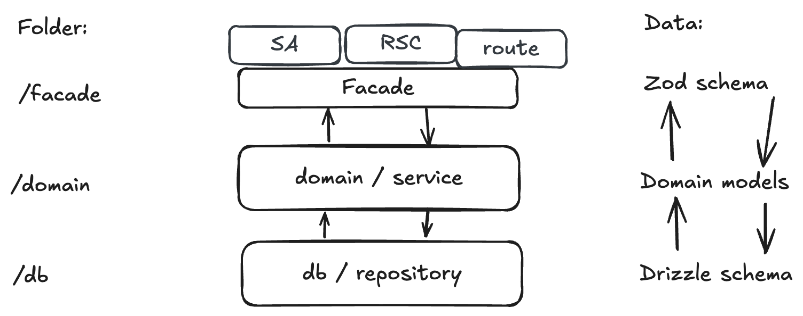

# Next.js Layers Showcase

This vibe coded repository is an example of how to work with the Next.js architecture and how to structure code into layers. 




## How to run

```bash
cd layers-showcase
npm install
npm run db:push
npm run db:seed
npm run dev
```

## How to test

```bash
cd layers-showcase
npm run test
```
